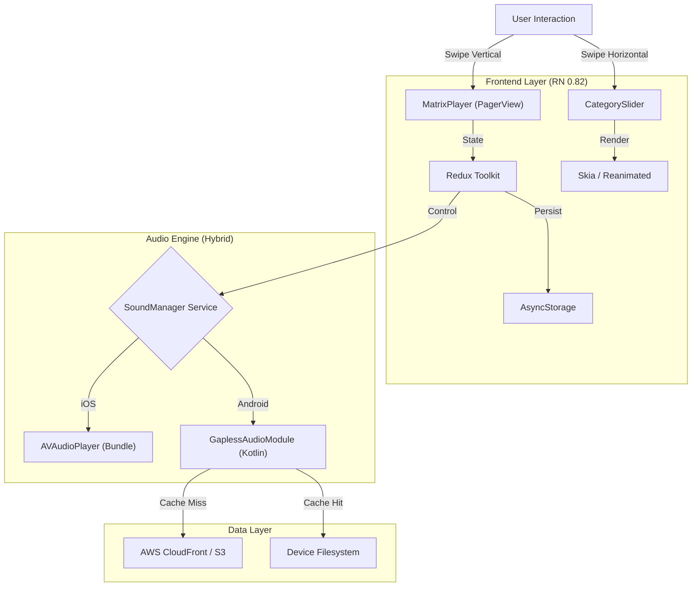

# Alpha Waves

# 📱 App Preview

https://github.com/user-attachments/assets/45969e30-cb1a-408e-b586-bcb5aedaf929
  

  
# 🧠 Transform your mind
  
Relax, Focus, and Sleep with Rain, Brown Noise, and Binaural Beats.
Alpha Waves is a high-performance audio sanctuary built to wash away stress and lock in focus. Whether you need to drift into a meditative trance or mask distracting background noise, this app provides the perfect sonic environment.
* 🌧️ Alpha State: High-definition rain soundscapes paired with scenic visual backdrops to promote calm and creativity (8-12 Hz).
* ⚡ Focus State: Scientifically tuned Brown & Pink Noise to mask distractions and improve productivity.
* 🧘 Theta State: A procedural "Breathe" deck featuring Binaural Beats (4-8 Hz) and synced visual guides for deep meditation.

# 🏗️ Technical Architecture

This project demonstrates a Cloud-Native Mobile Architecture built on React Native 0.82, utilizing the New Architecture (Fabric/TurboModules) for maximum performance.
* Hybrid Audio Engine (Gapless Playback)
   
To solve the industry-wide challenge of "Gapless Looping" on mobile, the app utilizes a split-brain architecture:
iOS: Leverages AVAudioPlayer via a custom implementation to load compressed assets (.m4a) into RAM for zero-latency looping.
Android: Bypasses the standard APK Asset Extraction bottleneck (which causes startup lag) by implementing a "Download-First, Stream-Fallback" strategy. Large audio assets are streamed from AWS CloudFront or served from the local Disk Cache, managed by a custom Native Module wrapping ExoPlayer.

* Procedural Graphics (Skia & Reanimated)

The "Theta" deck abandons video files in favor of React Native Skia. The "Breathing Orb" is rendered procedurally on the UI thread at 60fps using Reanimated Shared Values. This reduces the app bundle size by ~50MB while providing infinite resolution and battery-efficient animations.

* Event-Driven Asset Management

A Singleton SoundManager service handles asset prioritization. It utilizes an "Interleaved Loading" queue to fetch Critical Path assets (Slide 1) immediately, while lazy-loading secondary decks in the background to ensure Time-to-Interactive (TTI) is under 2 seconds.

|  |  |  |
| :---------------------------------------------: | :---------------------------------------------: | :---------------------------------------------: |
|  |  |  |

# System Diagram

# 🛠️ Tech Stack

* Framework: React Native 0.82 (New Architecture / Fabric Enabled)
* Language: TypeScript
* State Management: Redux Toolkit + Redux Persist
* Graphics: React Native Skia, Reanimated 3
* Navigation: React Navigation v6 + React Native Pager View
* Native Modules: Custom Kotlin (Android) & Swift (iOS) Audio Bridges
* Cloud: AWS S3 (Storage), AWS MediaConvert (HLS Transcoding), AWS CloudFront (CDN)

## Main vs design/release project versions

This is the main code project for Alpha Waves. You can find its design/release project here:
https://github.com/petemcgowan/AlphaWaves_design_release

